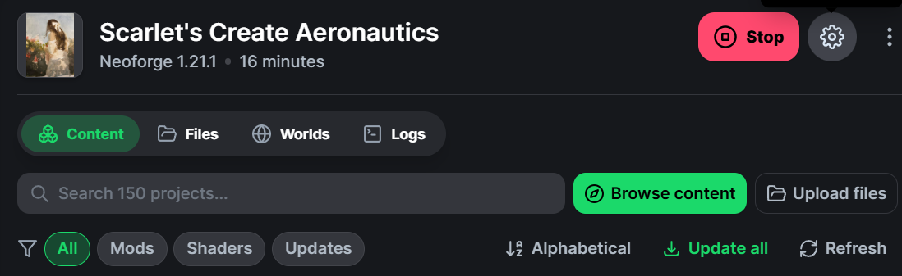
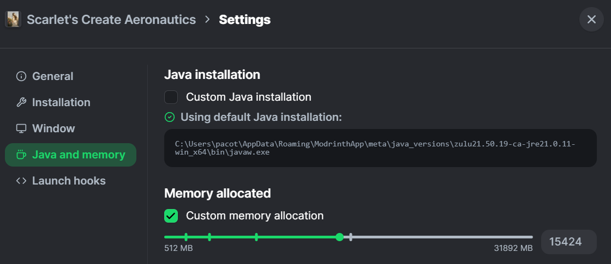

# Scarlet's Create Aeronautics Modpack Installation Guide

## Use the Modrinth App

We recommend using the **Modrinth App** for installation. It works similarly to CurseForge but makes setting up custom servers much easier.

[**Download the Modrinth App**](https://modrinth.com/app)

> Modrinth App is an open source launcher that allows you to play your favorite mods and keep them up to date, all in one neat little package. Very safe.

## Installation

1. Download the modpack file (essentially a ZIP file of the entire modpack).
2. Double-click the file to open it within the Modrinth App. :3

## Memory Settings

Press the **Gear** icon to modify the amount of dedicated memory for the modpack.

> Not sure what value is best for your setup - adjust as needed.

## Changelog

### 1.0.1
- Replaced Just Enough Items with Roughly Enough Items
- Replaced Graves mod with Corpse mod due to server crashes
- Added Mekanism Generators
- Added Exposure mod
- Added Horseman Mod
- Added Ore Vein Miner
- Update BSL Shaders to 10.1.13
- Update OpenParties to neoforge-1.21.1-0.26.2

### 1.0.0
- First release